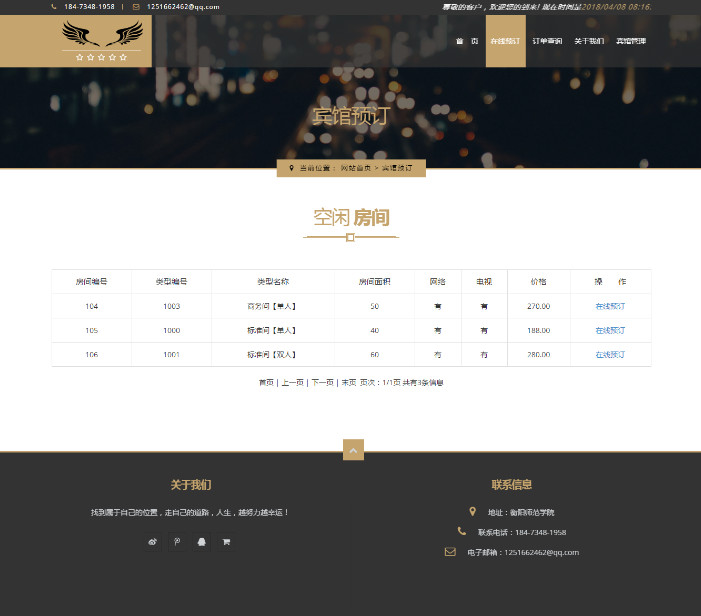
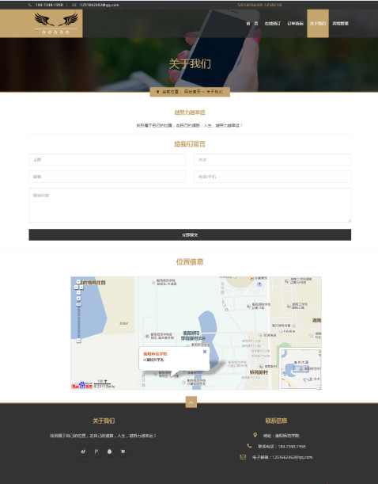
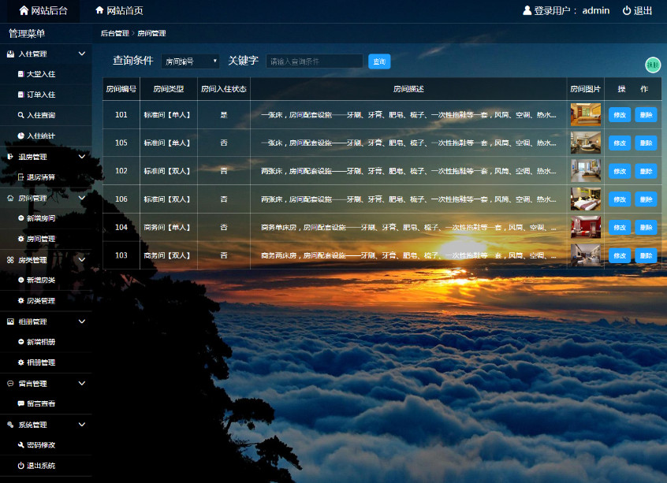

# hotel
基于PHP+Mysql实现的宾馆管理系统（毕设）。
* [点击查看项目展示](http://hb527.w12.tuomou.net.cn/)

# 主要模块

#### 1. 首页展示

首页界面通过bootstrap布局和CSS3属性以及jquery插件美化，介绍了宾馆房间的一些基本情况和宾馆以及周围的一些环境和生活场景

#### 2. 订单管理

前端显示空闲房间来供顾客选择和填写订单信息以及订单信息使用正则验证，后台管理处理和统计订单数据

#### 3. 关于我们

前端提交提交留言信息供后台查看以及提供宾馆地图位置

#### 4. 后台登录界面

背景轮播，提供随机验证码，账号admin 密码sdj，通过session来保存用户名，后台进行地址验证来重定向

#### 5. 房间和相册管理

可以对房间和相册信息进行增删改查，房间等展示进行分页管理，上传控件进行美化以及图片的预览和保存

#### 5. 系统管理

对系统管理员用户进行添加、删除和密码的修改

#### 5. 背景管理

后台页面背景使用的半透明，添加了背景图片替换功能，图片背景地址使用localStorage来存储

# 不足之处

* 管理人员没有进行权限管理

* 系统支付功能没有实现

* 数据较多时删除等处理不够友好

* 用户名注册那里没有判断是否存在相同用户

* PHP直接和前端糅合在一起，不便于复用和维护

# 效果图

## 首页

## 关于我们

## 登录

## 房间管理

## 背景替换

#  总结
####  经过长时间的努力，宾馆管理系统基本实现了，包括了基本的订单入住、管理和统计，房间、相册和留言的展示以及人员的登录和管理。我是通过使用Wamp集成工具开发的，它包含了所需要使用的PHP，Apache和MySQL数据库，省去了我许多的时间去整理这些零散的知识。
####  从开始的收集和学习有关资料，再到设计数据库和系统功能，最后在一一去实现完善，感触十分多，一步步走来发现没有想象中的难但也并不容易，想象中的难是因为不知从何开始，不知具体流程和分析，不知怎么把数据库更好的联系起来，不过后面通过网上的一些知识和参考一些小实例，慢慢的一步一步开始完成，中间也修改过许多次，虽还存在许多不足，但基本功能还是实现好了。并不容易是在于每实现一个功能看似简单却需要考虑许多东西，必须把它们彼此关联起来，也要考虑每一个模块的改变会影响到其它模块怎样的变化，有一些看似简单的小功能却需要反复的去测试和调整，也需要站在操作人员的角度来看待问题，怎样使其更容易懂、更容易操作和需要考虑到部分突发状态的出现来保证系统的稳定性和安全性
